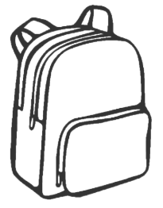

# Inclusion & equity practice

## CONVERGE Insights

* **“There is a loud call for us to take this learning” -** at the end of CONVERGE there was a strong call to action for each of us to do our learning about equity practice, identifying who is doing it strongly and growing this capacity as a field, not pretending that the shadows aren’t there. 
* **To dismantle oppression you must understand the deep history** including who benefitted from it. Ask yourself, how has my history, culture and identity led me to this work and where you are now? What strengths and privileges do you gain from power and oppression? 
* **Being human together, not just minds -** connecting past the boxes we put people in in our hearts and bringing our hearts, feelings, our whole selves. Practicing really hearing and seeing each other in a deeper way than just intellect. 
* **We must invest in engaging and working with our most vulnerable peoples** as they often have the least individual surplus of time and money. 
* **We can create spaces to explore the mainstream and margin at play in every group,** organization and system using [Deep Democracy](http://www.deepdemocracyinstitute.org/deep-democracy-explained.html) principles. [This exercise on rank](http://processworklane.com/rank-and-economy/) can be a good place to start to learn to negotiate these dynamics with dignity, clarity and accountability. Note : this is a high-trust exercise, proceed with care. 
* **Continuum of engagement : Informed by, doing with, doing as \(Diagram\)**

## Present questions

* What is the balance between tokenism and targeted diversity? Is it possible to go too far down the equity path laid with good intentions and lose sight of the practice? 
* What kinds of borders are we putting around our gatherings? What fears are they serving? 
* How can we create an environment where we can ask the hard questions of ourselves and each other, staying in respectful relationship through the discomfort?


## **Provocations for your lab**

**How human-centred is your design?** Designers are trained to be exclusive. How can we create better connections between ethnographic research and design to create richer, more valid personas that produce better prototypes and policy change? Could labs develop mastery of this?  
  
**Convening with equity practice at the heart.** What would change if we led with reconciliation as the foundational plenary, setting the DNA to practice conscious anti-discrimination in the whole event? What would it mean for the next gathering to not be majority white? How can we make space for those who are usually left out? This comes down to questions of valuing and leadership. Who is leading the event and who do they value being there?  
  
**Accessible language -** how can we make terminology that is easier to understand as a way of opening up the ‘black box’ of lab practice to everyone? Who are you currently excluding with the language you’re choosing to use?





### **What is the invisible backpack you carry with you everywhere?**

**What is the context and history** **that have shaped :**

* Your narratives about yourself
* Your values
* Your desires
* Your beliefs?



