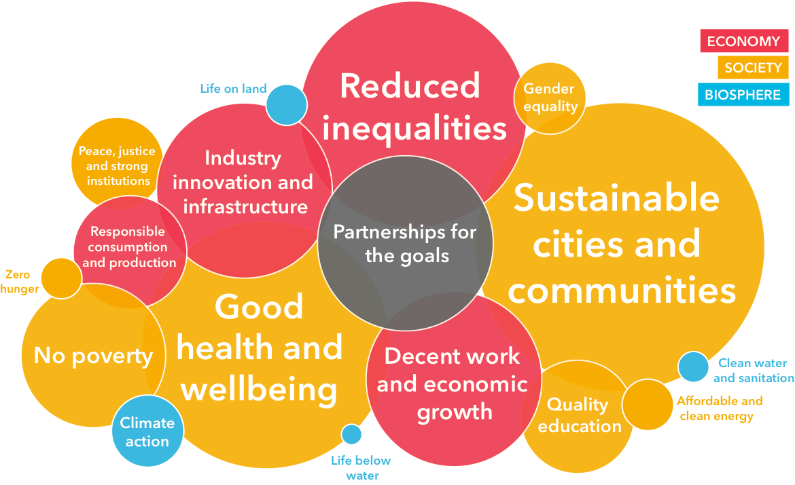

# Innovation for real transformation

## CONVERGE Insights

* **Going from best practice to next practice -** how can we ensure that our solutions aren’t just improving safety nets \(better variations of what already exists\) but instead creating trampolines that redefine the premise of the issue we’re working on? e.g. Green House Project vs. Rest homes. How are we peeling apart the status quo? 
* **We need to be non-neutral facilitators holding a strong values set,** reshaping preferences by showing alternatives and expanding the possibility space rather than just translating what people bring to us.  We need to be critically conscious of the frequent gap between espoused values and what is lived. Behaviour will reveal the dominant mechanics and logic of the system. 
* **Tools and processes can be false comforts,** giving us a sense that we’re doing innovative work while avoiding the challenge of hosting fundamentally different kinds of human interactions - radically authentic conversations. 
* **Be aware of who sets the ‘ends’ of your work -** is it you, your funders, clients or the people you’re meant to be serving? Practice uncovering and exposing the differences in endpoints between them. e.g. working with homeless, do they actually want housing and better case management or is something else important to them?

## Present questions

* What are we collaborating for? To produce innovative products or also dismantle existing power structures? Where is power being held and how is your lab shifting that? 
* Are our well-intentioned attempts at solving social problems actually further reinforcing the status quo? 
* Are we too focussed on process as a way to shift thinking and action? 
* How do we grapple with our own privileges and the length of time it takes to actually make the changes we want to see? 
* Are we making the right decisions about deploying scarce resources for the most important outcomes? 


## **Provocation for your lab - Aligning for impact on the UN Sustainable Development Goals?**

**We need to shift our focus in Labs from the ‘how’ to the ‘what for’. What impact is being made and why?**

The UN’s Sustainable Development Goals \(SDGs\) are a widely recognised and resourced model that lab’s could position themselves for impact on, using them as a common language to speak to government, funders and other large institutions. While Canada has high national averages in progressing the goals, indigenous and rural communities are significantly behind and we’re neglecting the biosphere goals.

**We need to ask ourselves :**

1. Where are the political priorities aligning?
2. Where are social movements focussing?
3. Where is investment capital pooling?

There is opportunity for the SDGs to enable Canadian labs to align around windows of opportunity, partner with complementary specialities and set a joint strategic agenda. This joined-up approach would allow labs to specialize more deeply into context and issue areas. What greater ambitions could we reach if we work together?


