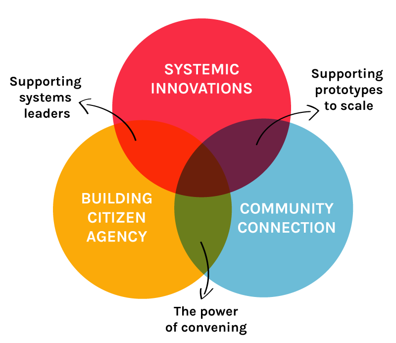

# Labs definition

## Purpose

### _**“Our long-term challenges call for comprehensive and collaborative work across sectors, because they are deeply rooted in cultural values, encoded in our institutions, and re-enacted each day through the behaviour of countless people. “**_

* **Darcy Riddell, McConnell Foundation** [An Emerging Community of Practice for Canadian Social Innovation Labs](https://mcconnellfoundation.ca/an-emerging-community-of-practice-for-canadian-social-innovation-labs/)

Social innovation labs aim to transform systems by getting to the roots of complex problems and involving a diverse range of stakeholders in the process.

Labs recognise that a lot of our biggest problems are embedded in our institutional logic - our patterns of power, authority and marginalization. By working intersectionally and bringing citizens and systems closer together, labs aim to generate new collective narratives based on shared understandings of how things could be different. The problems we work on are complex and intergenerational, problems for which there are no quick fixes and no one organization able to solve them.

This work is by necessity experimental. The answers don’t exist already so labs try things out and learn from doing. Labs create a safe container for this experimentation and learning to happen. They enable citizens to have a sense of creative agency over their futures.

Lab practitioners consider not just what they do, but how they know what they know, how they feel and how they are being. This reflexive way of seeing, being and doing is at the heart of lab practice.

## **Working minimum specification for labs**

Many things are being called ‘Labs’ these days. What labs look like and the methodologies they use in Canada is beneficially diversified. One of the questions we heard again and again at CONVERGE is “I don’t know if I’m in a lab or not”. This minimum specification has been devised to help people answer that question.

**A lab must be :**

* [ ] Thinking and acting across scales \(systemic\)
* [ ] With diverse stakeholders, including people with lived experience of problem \(social\)
* [ ] In sustained, iterative experiments \(experimental\)
* [ ] To solve highly complex, intergenerational, wicked problems \(transformational\)

## **Impact of labs**

The impact labs can have is three-fold. Our outputs are prototypes which can me implemented as systemic innovations, but the greater impact labs have is in empowering citizens and increasing the connectivity of communities; creating high-trust constituencies equipped to understand and evolve systems.  
  

