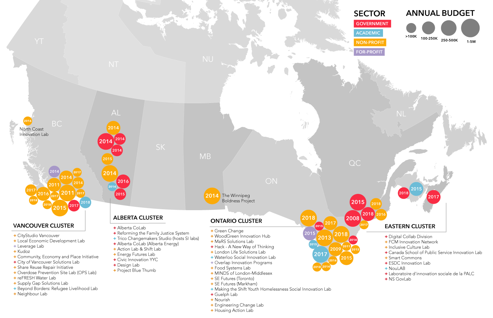

# Canadian Labs Landscape

Canada is home to one of the most diverse social innovation lab ecosystems in the world. They’re being established from government, non-profit, for-profit and academic sectors, addressing a wide range of intractable issues that Canadians care deeply about.

**What's a social innovation lab?** See our working definition below.





Prior to CONVERGE we sent out an online survey which 53 labs from across Canada completed. Some of the results of this survey are captured in this report. For the full results see the Canadian Labs Landscape 2018 slide deck.

